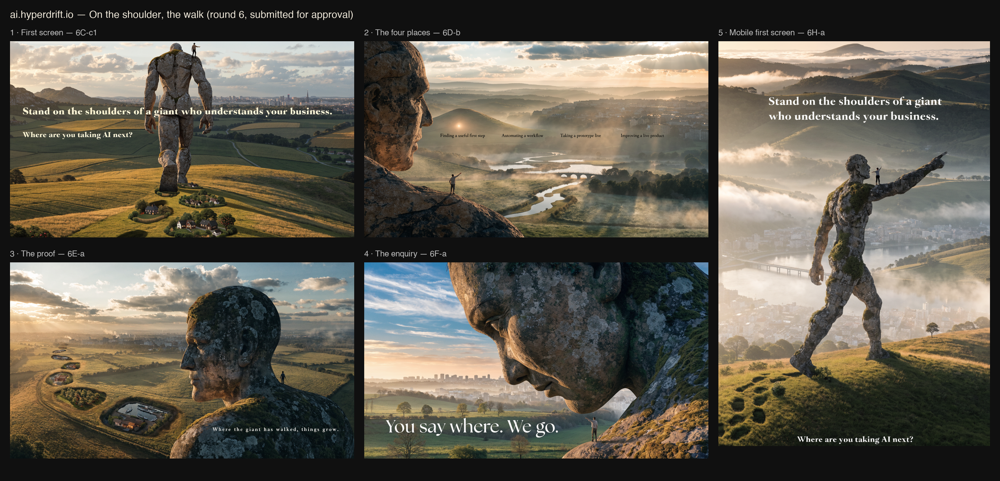

# Round 6 — the approved walk, repaired

Parent: [Round 5](CANDIDATES-ROUND5.md) · decisions: [SELECTION.md](SELECTION.md). The founder approved the round-5 walk; this round changed only the named flaws. Twelve images, `recraftv4_1_pro`, seeds 601–612, each guided by its own round-5 image.

## Submitted as the screens to build

| Screen | Image | Flaw repaired |
|---|---|---|
| First screen | `6C-c1.png` | The giant is whole and mid-stride, one foot lifting, carved as a blocky granite monolith; villages grow in its footprints again; the founder points from the shoulder. |
| The four places | `6D-b.png` | The founder stands on the giant's shoulder; the hill light, the water channels, the bridge and the city sit beneath their four labels. |
| The proof | `6E-a.png` | The founder is back on the shoulder, behind the giant's neck, looking over the footprint trail of orchard, workshop and harbour. |
| The enquiry | `6F-a.png` | The scale is unmistakable: the giant lowers its face to a small whole person on its shoulder, who points at the city. |
| Mobile first screen | `6H-a.png` | The founder stands on the giant's shoulder, arms open, as the giant points ahead. |

## Passed over

- `6C-a`: legs present but the giant grew stone hair and the footprint villages vanished.
- `6C-b`: the clearest stride, but a bare anatomical stone backside and empty footprints. Wrong for a business front door; used only as the reference for 6C-c.
- `6C-c2`: the founder stands on top of the giant's head again.
- `6D-a`: serene, but the founder stands on the giant's arm and the labels still float in a row.
- `6E-b`: the founder is clearly on the shoulder, but the footprints read as looping paths rather than a walk.
- `6F-b`: the founder stands on a stone ledge by the giant's nose, which reads as a finger or a tongue.
- `6H-b`: the founder is still on the arm, and the giant turned blocky and toy-like.

## For implementation, once approved

Words baked into these images are art direction only. The statement, the question, the four labels and "Where the giant has walked, things grow." / "You say where. We go." become live text over the imagery. The four labels become the approved stage entry, keyboard and touch reachable, prefilling the enquiry. The proof names come from `src/data/case-studies.ts` with their organiser credit. ScreenCraft maps each approved screen one image at a time.
