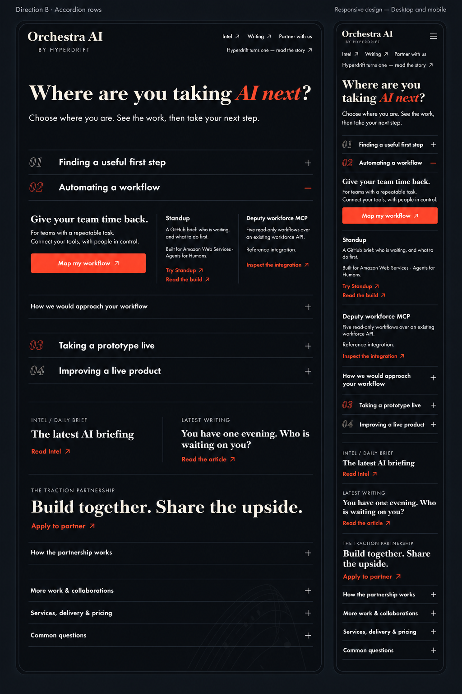

# Round 1 — Find your next step

**Recommendation: B, expandable situations. Implemented as the local preview on 14 September (both Codex and Claude recommended B); founder confirmation still pending — A or C remain buildable from the same data source.**

The founder asked for an active, relevant front door to Hyperdrift's AI work: identify who needs help and where they are, support every stage with real examples and an action, link Intel and current writing, surface partnership, and collapse the long explanations. The existing Orchestra design remains the foundation.

[Brief and four-stage evidence map](BRIEF.md) · [Content/freshness contract](CONTENT-CONTRACT.md) · [Implementation handoff](IMPLEMENTATION-HANDOFF.md)

All three final images show the same workflow-automation situation, Standup/AWS and Deputy evidence, current-content links, pinned anniversary, partnership, and collapsed supporting detail. Each includes desktop and mobile. Board aspect ratios differ after correction; compare the navigation pattern, not the reduced type size in the contact-board rendering.

## A — Choose a stage


**Strength:** all four choices remain visible; switching changes the shared response and its examples. Fastest comparison between situations.

**Trade-off:** tabs add more interface and selection state. Mobile needs properly sized 2×2 choices, not tiny compressed labels from the whole-page image.

## B — Open your situation · recommended



**Strength:** closest to the inspected NextRole interaction. Four concise rows; opening one reveals who it serves, why it matters, inspectable examples and a specific action. Long material is naturally closed. The page needs little interface machinery.

**Trade-off:** an open situation makes later situations lower on the page, particularly on mobile. Keep content concise; allow closing it immediately. All begin closed on first visit; this board demonstrates 02 after selection.

**Minor implementation corrections:** only the active numeral is vermillion; stage 03 remains neutral while closed. Remove the redundant hamburger where all navigation links are already visible. Preserve existing solid button fill instead of generated image texture. These are render defects, not new requirements.

ScreenCraft breakdown is prepared under `screencraft-B/` for this recommended candidate. This is not recorded as founder approval.

## C — Browse by stage


**Strength:** a stable desktop stage rail sits beside relevant examples. Useful for comparing services while keeping context.

**Trade-off:** takes more space on desktop; the mobile selector hides other choices until opened. Less immediate than A/B for a new visitor.

## What changes after selection

- Four situation-specific entry routes, each with real HD/POC/article evidence and an action.
- Existing contact form receives the selected situation visibly and editably.
- Intel and published writing refresh from dated content feeds. The anniversary remains pinned independently.
- Partnership invitation visible; detail closed. All five contest cases preserved in the catalogue with organiser/event/status credits.
- Existing visual identity retained. Current prototype remains at http://127.0.0.1:3108 while this design is reviewed. No UI code has changed during this round; no deployment.

## Generation and quality review

Initial canonical Recraft generations (model `recraftv4_1_utility_pro`, seeds 101/102/103) preserved colour direction but corrupted text and mobile content. They are archived as `*-draft.png` and are rejected. Each final candidate received one native-imagegen correction using its original image as reference. All final images were visually inspected. Metadata and full prompts are retained; corrected image provenance must not be confused with original Recraft metadata. Exactly three final candidates are presented.

The corrections recover the fixed content, selected state, smaller masthead and mobile sections; they do not authorize a new brand, claim or interaction beyond the brief. No fabricated metrics or customer endorsements are approved by any generated image.

## Sources and gate

Reference inspected directly: https://nextrole.site (“Which one are you?” native disclosures, specific guidance and CTA). Feed/evidence research and community design references are recorded in CONTENT-CONTRACT.md. Voice Covenant: `meta/PHILOSOPHY.md` §8 Speak to Enable.

Workspace AGENTS.md requires exactly three comparable images and explicit selection for a material redesign. The designer skill states: “Do not edit HTML, JSX, CSS, components, or production assets before explicit approval.” The selection is the remaining design gate, not a request to redo the research.

## Full prompts

<details><summary>A initial</summary>

```text
Create exactly one polished high-fidelity responsive website design comparison board, portrait 2:3 aspect ratio, with desktop and mobile views side by side. This is direction A, horizontal situation tabs, for the established Orchestra AI by Hyperdrift website. Emotion: They understand where I am, and I can see what to try next. Preserve Concert Hall × Lab Notebook identity: ink #0c0c10 background, raised ink #14141c surfaces, warm cream #f0e9da text, vermillion #ff4a1c accent; Fraunces expressive serif headlines, IBM Plex Sans body, IBM Plex Mono small labels. Hairline staff-line rules, restrained 4px corners, outlined italic movement numbers. Exquisite typography and editorial craft, clear actual interactions. This is an established engineering practice becoming easier to use. No brand reset.

Compose board with desktop 1440px design-width view occupying the left 74%, mobile 390px design-width view right 22%, small neutral gap. Both show identical selected second situation. Show coherent full-page compositions from masthead to compact disclosures, readable at high resolution, no device bevels or browser chrome. Small board label at top A / CHOOSE YOUR NEXT STEP. Use disciplined generous space but compact enough to show useful content early. Desktop hero takes no more than one quarter of page. Mobile lets content flow naturally. All longer explanation rows closed with plus signs, selected stage evidence and CTAs visible. Tiny musical staff ornament provides continuity, not a big decorative hero.

Masthead: Orchestra AI, small BY HYPERDRIFT. Desktop nav Intel ↗, Writing ↗, Partner with us. On mobile retain compact nav labels, no crowded headline. Slender anniversary strip: Hyperdrift turns one — read the story ↗.
Hero headline large cream Fraunces: Where are you taking AI next? Set AI next in expressive vermillion italic. One sentence in smaller cream sans: Choose where you are. See the work, then take your next step.

DIRECTION A INTERACTION: Four equal horizontal situation tabs directly below the hero, above one shared selected response. Each tab has a small movement number and meaningful multi-line title: 01 Finding a useful first step; 02 Automating a workflow; 03 Taking a prototype live; 04 Improving a live product. Second tab visibly selected with vermillion lower border and accent number, other three subdued cream. Fine thin staff line joins the four choices. These must look selectable, not four services cards. Mobile is a clear 2 by 2 grid of the same four choices with proper touch targets, second top-right selected. No sidebar stage rail and no accordion stage list.

Shared response below tabs, editorial open composition on raised ink: eyebrow 02 / AUTOMATING A WORKFLOW. Serif heading Give your team time back. Supporting text For teams with a working product or a repeatable task. Connect the tools you already use, with people in control. Vermillion solid primary button Map my workflow ↗. Then two compact evidence items side by side desktop, stacked mobile, minimal lines rather than heavy boxes. First: Standup. A GitHub brief: who is waiting, and what to do first. Small attribution Built for Amazon Web Services · Agents for Humans. Clearly clickable links Try Standup ↗ and Read the build ↗. Second: Deputy workforce MCP. Five read-only workflows over an existing workforce API. Small attribution Reference integration. Link Inspect the integration ↗. After these examples one CLOSED hairline disclosure row How we would approach your workflow +.

Next a compact current-content area in two columns desktop and stacked mobile. First column mono label INTEL / DAILY BRIEF, serif The latest AI briefing, link Read Intel ↗. Second mono label LATEST WRITING, serif You have one evening. Who is waiting on you?, link Read the article ↗. These are living sources and clearly distinct outgoing actions, with elegant typographic hierarchy, no invented headlines or dates.

Below a slim memorable partnership invitation marked THE TRACTION PARTNERSHIP. Serif headline Build together. Share the upside. Visible action Apply to partner ↗. CLOSED row How the partnership works +. A small vermillion staff or equalizer motif may mark this area. Finish with three compact CLOSED hairline disclosures: More work & collaborations +; Services, delivery & pricing +; Common questions +. Restrained footer Orchestra AI / BY HYPERDRIFT.

Maintain all fixed words and sections above in both desktop and mobile. The focus is an interactive self-selected situation leading to useful evidence and action, not a static brochure or dashboard. Never fabricate logos, client names, endorsements, ROI numbers, testimonials, extra form inputs, readiness scores, or badges. Voice Covenant — Hyperdrift meta/PHILOSOPHY.md section 8 Speak to Enable: every word must leave a user more capable, strengths first, user work is the source of truth, never shame or fear. Use only supplied claims. Professional production-ready visual fidelity with precisely aligned edges and crisp legible real text.

```

</details>

<details><summary>A correction</summary>

```text
Repair the provided design board into a precise high-fidelity final website concept A. It must show desktop and mobile side by side, preserving ink #0c0c10, cream #f0e9da, vermillion #ff4a1c, Fraunces serif display and italic accent, Plex Sans body and Plex Mono small labels, delicate musical staff-line identity. Replace ALL gibberish with exact copy below. Make masthead SMALL, left aligned: Orchestra AI, BY HYPERDRIFT, nav Intel ↗ / Writing ↗ / Partner with us. Do not use huge rounded containers; use open editorial layout, subtle hairline rules, 4px maximum corner radius. Increase canvas resolution and height if needed so ALL content appears in BOTH desktop and mobile. Desktop width1440 and mobile390 proportions.

Both views: slender anniversary link Hyperdrift turns one — read the story ↗. Hero Where are you taking AI next? with AI next in vermillion italic. Subtitle Choose where you are. See the work, then take your next step.

CENTRAL INTERACTION A must be corrected exactly: four horizontal equal tabs on desktop, 2x2 choice grid mobile. Tab01 Finding a useful first step; Tab02 Automating a workflow; Tab03 Taking a prototype live; Tab04 Improving a live product. Highlight ONLY02 with vermillion underline and selected state. Every label different and fully readable. No duplicated choices. After tabs shared response eyebrow02 / AUTOMATING A WORKFLOW. Heading Give your team time back. Paragraph For teams with a working product or a repeatable task. Connect the tools you already use, with people in control. Primary button Map my workflow ↗.

Two compact evidence items, side by side desktop, stacked mobile. Standup / A GitHub brief: who is waiting, and what to do first. / Built for Amazon Web Services · Agents for Humans / Try Standup ↗ / Read the build ↗.
Deputy workforce MCP / Five read-only workflows over an existing workforce API. / Reference integration / Inspect the integration ↗.
One CLOSED disclosure How we would approach your workflow +.

MANDATORY current content in both views, NEVER omit mobile: INTEL / DAILY BRIEF, The latest AI briefing, Read Intel ↗. LATEST WRITING, You have one evening. Who is waiting on you?, Read the article ↗. Two columns desktop, stack on mobile.

Partnership invitation: THE TRACTION PARTNERSHIP, Build together. Share the upside., Apply to partner ↗. Closed How the partnership works +.
Three closed footer rows: More work & collaborations +; Services, delivery & pricing +; Common questions +.
Small footer Orchestra AI / BY HYPERDRIFT.

The desktop may be shorter than mobile; preserve natural responsive proportions instead of dropping mobile sections to match height. Make all text crisp with no overprinting or nonsense. Keep hero small enough that choices and selected response start early, focus on usable situations and evidence rather than branding.
Voice Covenant — Hyperdrift meta/PHILOSOPHY.md §8 Speak to Enable: every word leaves users more capable, strengths first, no shame/fear, user work is source of truth. Use only provided text and no invented metrics/logos/endorsements.

```

</details>

<details><summary>B initial</summary>

```text
Create one polished high-fidelity responsive website design board, portrait 2:3 canvas. Show a complete desktop page at 1440px design width on the left, a narrow 390px mobile page on the right, both large enough to read, not device mockups. The product is Orchestra AI by Hyperdrift at ai.hyperdrift.io. The visitor should feel: they understand where I am, and I can see what to try next. Preserve the existing Concert Hall × Lab Notebook identity: ink #0c0c10 background, subtle raised ink #14141c, warm cream #f0e9da text, vermillion #ff4a1c accents, expressive Fraunces display serif with vermillion italics, IBM Plex Sans body, IBM Plex Mono labels, hairline musical staff rules, restrained four-pixel corners, outlined italic movement numerals. This is a useful interactive entry, beautifully typeset, not a generic marketing brochure or dashboard. Desktop and mobile show the same state and content. Compact generous hierarchy: the situation controls begin immediately after the short hero, with no oversized artwork pushing the controls down.

The distinctive interaction is FOUR FULL-WIDTH TYPOGRAPHIC ACCORDION ROWS with fine horizontal rules and small plus/minus controls aligned far right. The first, third and fourth rows are CLOSED, just their number and label visible. The second row is OPEN, unfolding the relevant short response and concrete examples directly inside that row. All four situation labels remain visible in document order: 01 Finding a useful first step; 02 Automating a workflow; 03 Taking a prototype live; 04 Improving a live product. Use the large thin outlined movement numbers as a signature but keep the label dominant and readable. Second row has a vermillion minus, others cream plus signs. Do not duplicate the second situation title as another header. Desktop expanded response uses the left half for the outcome and enquiry action, the right half for two compact evidence items. Mobile stacks the same content naturally beneath the open second row. Neither tabs nor left sidebar navigation: the accordion itself is the stage navigation and disclosure.

Exact content and reading order: Masthead Orchestra AI with small BY HYPERDRIFT attribution. Navigation Intel ↗, Writing ↗, Partner with us. Slender visible anniversary link Hyperdrift turns one — read the story ↗. Hero in expressive serif: Where are you taking AI next? with AI next in vermillion italic. Supporting sentence: Choose where you are. See the work, then take your next step.

Then four accordion rows as above. Within open row 02, heading Give your team time back. Body: For teams with a working product or a repeatable task. Connect the tools you already use, with people in control. One prominent restrained vermillion primary button Map my workflow ↗. Evidence item one: Standup. A GitHub brief: who is waiting, and what to do first. Small credit Built for Amazon Web Services · Agents for Humans. Visible links Try Standup ↗ and Read the build ↗. Evidence item two: Deputy workforce MCP. Five read-only workflows over an existing workforce API. Small credit Reference integration. Visible link Inspect the integration ↗. A closed thin-row disclosure How we would approach your workflow + below the evidence. Then the closed 03 and 04 rows.

Below the accordion, a compact two-column current-content strip on desktop, stacked on mobile. First column small INTEL / DAILY BRIEF, headline The latest AI briefing, link Read Intel ↗. Second small LATEST WRITING, headline You have one evening. Who is waiting on you?, link Read the article ↗. No invented dates or news headlines. Then a distinct slim partnership invitation: small THE TRACTION PARTNERSHIP, serif headline Build together. Share the upside., action Apply to partner ↗. Beneath it a closed How the partnership works + row. Finish with three compact CLOSED rule-separated disclosures More work & collaborations +, Services, delivery & pricing +, Common questions +. Keep the result densely useful but calm: deliberate whitespace, extremely clear typography, crisp desktop alignment, natural mobile wrapping with readable tap targets. No big distracting illustrations; typography and musical line rhythm carry the identity. No invented metrics, extra sections, logos, testimonials, claims, or commercial terms.

Voice Covenant, Hyperdrift meta/PHILOSOPHY.md §8 Speak to Enable: every word leaves the user more capable; strengths first; no shame, fear, blame or hype. The user's work is the source of truth. Use only the specified grounded copy. This is direction B, Accordion rows; put that small board caption outside the rendered page, not in website copy.

```

</details>

<details><summary>B correction</summary>

```text
Edit the attached responsive design board into a precise, polished implementation reference for direction B, Accordion rows. Keep its Orchestra AI brand, ink #0c0c10, cream #f0e9da and vermillion #ff4a1c, Fraunces-style serif with italic red accents, Plex-style sans and mono labels, thin musical rules and outlined movement numbers. Keep desktop on left and mobile on right. You may enlarge canvas or redistribute space to fit all content clearly. Correct EVERY garbled text and duplicate action. Make a professional UI design, not a sketch.

CRITICAL STRUCTURAL REPAIR on BOTH desktop and mobile: Four accordion stages exist in document order. Row 01 Finding a useful first step has plus and is CLOSED. Row 02 Automating a workflow has minus and is OPEN; its response, CTA, Standup and Deputy examples, and approach disclosure appear INSIDE row 02 immediately following its label and BEFORE row 03. Then row 03 Taking a prototype live is CLOSED with plus. Row 04 Improving a live product is CLOSED with plus. No content may sit between 03 and 04. No extra minus. The mobile must have all FOUR correctly named stages, not fake company-credit rows. This is a vertically expanding accordion, not a list followed by a shared panel.

Use this exact readable content, shortening only supporting body sentences if layout demands. Masthead Orchestra AI, BY HYPERDRIFT. Small links Intel ↗, Writing ↗, Partner with us. Anniversary link Hyperdrift turns one — read the story ↗. Hero Where are you taking AI next? with AI next italic vermillion. Subline Choose where you are. See the work, then take your next step. Make hero compact so situation entry appears quickly. Do not add decorative duplicate logo or excessive top whitespace.

Inside open stage 02: Give your team time back. Body For teams with a repeatable task. Connect your tools, with people in control. Primary button Map my workflow ↗. Example Standup, body A GitHub brief: who is waiting, and what to do first. Credit Built for Amazon Web Services · Agents for Humans. Links Try Standup ↗ and Read the build ↗, exactly once each. Example Deputy workforce MCP, body Five read-only workflows over an existing workforce API. Credit Reference integration. Link Inspect the integration ↗. Closed row How we would approach your workflow +. Desktop response and CTA can be left with two evidence columns right, mobile stacks in this same reading order. Then closed rows 03 and 04.

After all four stages, BOTH desktop AND mobile MUST include: compact INTEL / DAILY BRIEF with The latest AI briefing and Read Intel ↗; compact LATEST WRITING with You have one evening. Who is waiting on you? and Read the article ↗. Desktop two columns, mobile stacked. Then THE TRACTION PARTNERSHIP with Build together. Share the upside. and Apply to partner ↗. Then How the partnership works +. Finally three closed rows More work & collaborations +, Services, delivery & pricing +, Common questions +. Do not omit any mobile section. The mobile may be longer than desktop to accommodate the real content. Its tiny text must remain legible; preserve the exact labels and action names. No invented dates, numerical claims, metrics, company logos, endorsements or alternative copy. Put a small Direction B · Accordion rows caption outside the pages.

Hyperdrift Voice Covenant — meta/PHILOSOPHY.md §8 Speak to Enable: the user is capable; strengths first; no shame, fear or hype. Only the supplied grounded claims. This image is a repair of a malformed render, retaining its visual foundation while correcting structure, mobile completeness and text.

```

</details>

<details><summary>C initial</summary>

```text
Create one high-fidelity responsive website design board for Orchestra AI by Hyperdrift. Portrait 2:3 canvas, desktop webpage on the left occupying 73% of board width, mobile webpage on the right occupying 24%, a narrow dark gap between. Show desktop at conceptual 1440px width and mobile at 390px width, both full-page crops long enough to show the same content skeleton. Design C: a fixed-width left stage navigation rail alongside one selected response on desktop; a compact native stage selector immediately above the response on mobile. This is an evolution of the established Concert Hall × Lab Notebook brand. The user should feel understood and immediately see what to try next. Render a refined actual interface, no device mockups or decorative perspective.

Use ink #0c0c10 background, subtle raised ink #14141c response surface, cream #f0e9da typography, vermillion #ff4a1c active controls and italic words. Fraunces serif large display, IBM Plex Sans readable body, IBM Plex Mono small labels. Thin musical staff hairlines, restrained four-pixel corners, very subtle outlined italic movement numeral 02 behind selected content. Contrast and fine typography do the work, not card clutter. Preserve the musical editorial identity. Compact yet generous, practical and alive. No generic gradient or invented logos or trust metrics. Every visible control has generous usable padding.

The following is exact copy; respect meta/PHILOSOPHY.md section 8 Speak to Enable, the Voice Covenant: words leave the user more capable, strengths first, never shame or fear. No invented claims.

Top masthead: Orchestra AI, with BY HYPERDRIFT in small monospace below. Right navigation Intel ↗, Writing ↗, Partner with us. Thin visible anniversary link beneath masthead: Hyperdrift turns one — read the story ↗.
Hero, medium height: Where are you taking AI next? Set AI next in vermillion italic. Underneath: Choose where you are. See the work, then take your next step.

Immediately below, the core interaction. On desktop a narrow left rail occupying 28% of content width has four numbered multiline text choices separated by faint rules. 01 Finding a useful first step. 02 Automating a workflow. 03 Taking a prototype live. 04 Improving a live product. Second choice visibly selected with vermillion number and a fine vermillion left rule. Keep other three choices readable, subdued cream, never truncated. To its right, one wide response occupying 68%, clean editorial surface with ample content room. In mobile show compact selector labeled YOUR NEXT STEP and selected option 02 Automating a workflow with downward chevron; then the same selected response. No forced quiz, and no dashboard/sidebar app chrome.

Selected response has small eyebrow 02 / AUTOMATING A WORKFLOW. Large cream serif heading Give your team time back. Short body For teams with a working product or a repeatable task. Connect the tools you already use, with people in control. Primary vermillion button Map my workflow ↗.
Below, two compact evidence items separated by hairlines, with immediately visible textual links. First title Standup. Description A GitHub brief: who is waiting, and what to do first. Small vermillion attribution Built for Amazon Web Services · Agents for Humans. Links Try Standup ↗ and Read the build ↗. Second title Deputy workforce MCP. Description Five read-only workflows over an existing workforce API. Small label Reference integration. Link Inspect the integration ↗. End response with a closed disclosure row How we would approach your workflow +. No expanded lengthy prose.

Below the interaction, full content width, a compact current-content strip with two editorial columns on desktop, stacked on mobile. First label INTEL / DAILY BRIEF, title The latest AI briefing, link Read Intel ↗. Second label LATEST WRITING, title You have one evening. Who is waiting on you?, link Read the article ↗. Do not invent an AI news headline or date.

Then a distinct slim partnership invitation with thin vermillion top rule. Label THE TRACTION PARTNERSHIP. Serif title Build together. Share the upside. Link Apply to partner ↗. Below a closed disclosure How the partnership works +. Then three compact closed rows More work & collaborations +, Services, delivery & pricing +, Common questions +. Keep these visibly closed and visually secondary. Small restrained musical equalizer footer marks. Desktop and mobile both contain these same sections; no repeated navigation rail below. The board should feel like a useful stage-driven entry into a living AI practice, with editorial current content and concrete actions, never a long static brochure.

```

</details>

<details><summary>C correction</summary>

```text
Repair this SAME responsive Orchestra AI website design board C, keeping desktop stage rail at left of selected evidence panel and mobile compact selector. Produce a high-fidelity corrected desktop + mobile comparison image, no extra variants. Portrait board with desktop 73% width, mobile24% side by side. Mobile may extend taller so all content appears. Keep ink #0c0c10, cream #f0e9da, vermillion #ff4a1c, IBM Plex Sans body, IBM Plex Mono labels. CRITICAL: small understated Orchestra AI masthead 30px desktop, BY HYPERDRIFT beneath, not gigantic brand masthead. The main hero is large beautiful Fraunces SERIF: 'Where are you taking AI next?' with 'AI next' vermillion ITALIC. Include same hero on mobile. No round pill buttons; use 4px radius rectangular buttons. No large rounded panel. Fine musical staff hairlines and outline 02 motif. Exact copy and proper readable text on BOTH desktop/mobile: Navigation 'Intel ↗', 'Writing ↗', 'Partner with us'. Slender anniversary link 'Hyperdrift turns one — read the story ↗'. Hero supporting sentence 'Choose where you are. See the work, then take your next step.' Desktop rail has exactly4 choices in order: '01 Finding a useful first step', '02 Automating a workflow', '03 Taking a prototype live', '04 Improving a live product'. Highlight ONLY02 in vermillion with left accent rule, all others cream. Mobile selector: 'YOUR NEXT STEP' above '02 Automating a workflow' down chevron, not the full rail. Response eyebrow '02 / AUTOMATING A WORKFLOW'. Response heading large SERIF 'Give your team time back.' Body exact: 'For teams with a working product or a repeatable task. Connect the tools you already use, with people in control.' Vermillion CTA 'Map my workflow ↗'. Both desktop and mobile MUST show two evidence entries fully: 'Standup', 'A GitHub brief: who is waiting, and what to do first.', 'Built for Amazon Web Services · Agents for Humans', links 'Try Standup ↗' and 'Read the build ↗'. Then 'Deputy workforce MCP', 'Five read-only workflows over an existing workforce API.', 'Reference integration', link 'Inspect the integration ↗'. Closed detail row 'How we would approach your workflow +'. Below response, current content desktop two columns/mobile stacked: label 'INTEL / DAILY BRIEF', title 'The latest AI briefing', link 'Read Intel ↗'; label 'LATEST WRITING', title 'You have one evening. Who is waiting on you?', link 'Read the article ↗'. Keep Intel text and article text correctly assigned. Below that a SLIM partnership invitation with label 'THE TRACTION PARTNERSHIP', SERIF title 'Build together. Share the upside.', link 'Apply to partner ↗', closed 'How the partnership works +'. Three closed detail rows at bottom: 'More work & collaborations +', 'Services, delivery & pricing +', 'Common questions +'. Do not merge or omit rows on mobile. Make layout compact, not padded out brochure. Exact complete copy takes precedence over decorative empty space. Desktop and mobile show all same sections and same selected stage; no duplicated content or gibberish. This follows meta/PHILOSOPHY.md section8 Speak to Enable Voice Covenant: every line leaves user more capable, no fear/shame or fabricated metrics, user work source of truth. These are real evidence-linked examples, not sponsor endorsement. Preserve fine editorial musical identity and show useful interaction first.

```

</details>
