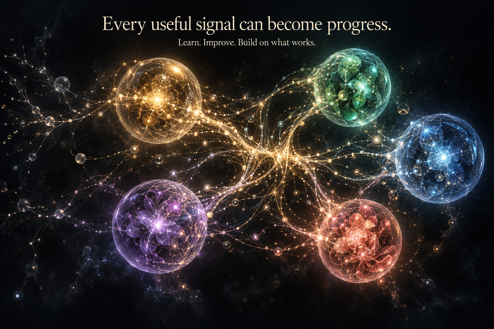
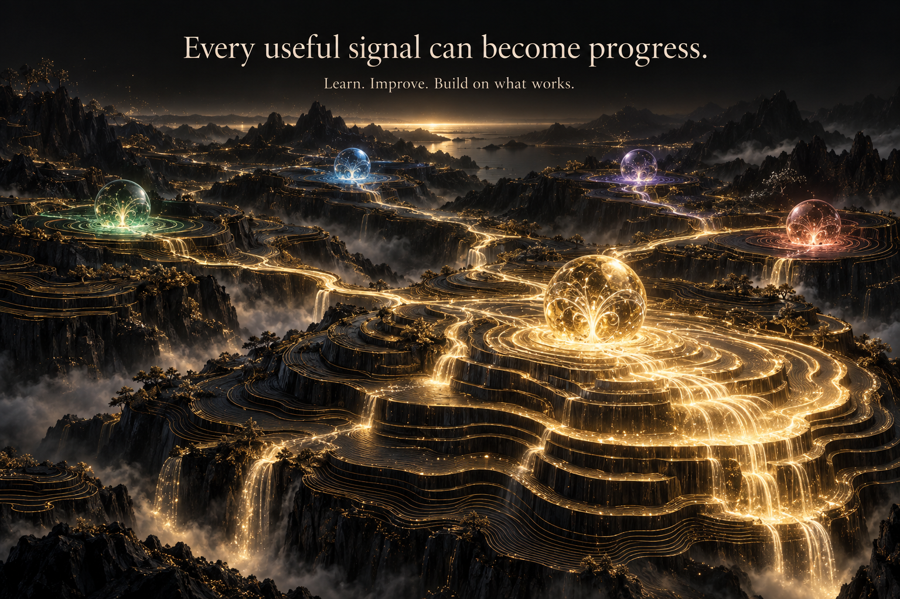
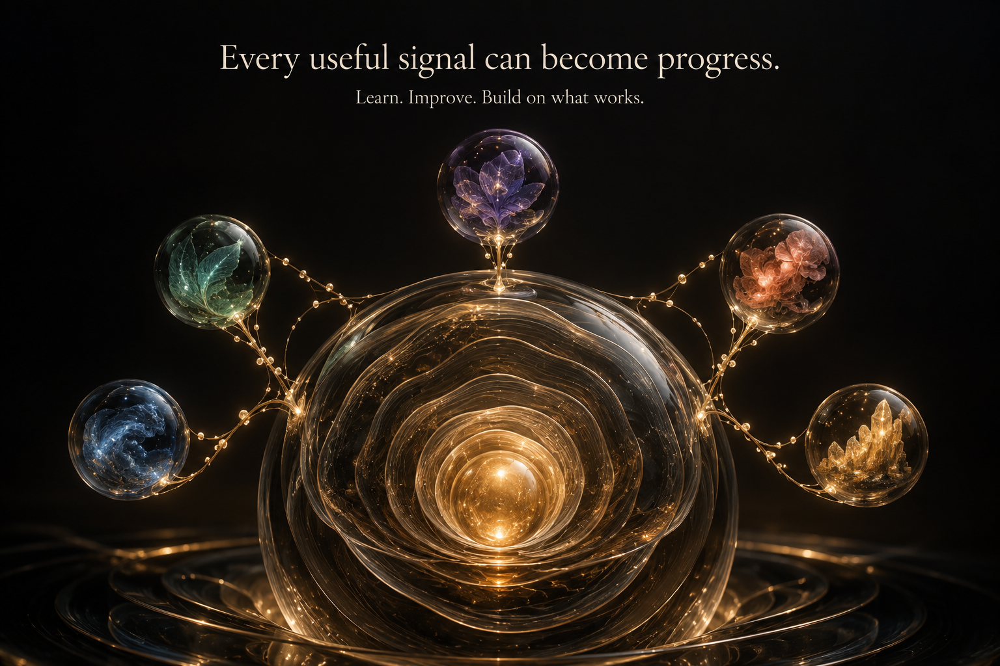

# Business flow — three organisation directions

Status: **A selected by the founder and implemented in local preview** at `/how-it-works`. The images below preserve the three original candidates. [Selection, implementation and verification](SELECTION.md).

Shared mission: make branching business signals and retained improvements tangible for a founder seeking growth, profit and time to lead. Same ink/ivory/gold identity, five coloured domains, same copy and 1536 × 1024 viewport. Exactly one generated image per direction, independently explored and visually inspected. Built-in image generation used because Recraft credits were exhausted. None is represented as product or client evidence.

## A — Living constellation (selected)

Signals branch through a living network of coloured domains. Best continuity with the requested homepage spheres and strongest foundation for exploration. Retained light traces must make completed learning visible; richness alone does not explain progress. [Brief](ecosystem.md).

## B — Terraces of progress

Streams connect luminous layers of a growth landscape. Most cinematic and a tangible upward journey. The terrain is denser, less direct and costlier to render; simplify scenery for production. [Brief](terraces.md).

## C — Growth rings

A central memory core gains a layer for each validated improvement. Clearest metaphor for compounding learning. More abstract about the work between domains, so concrete scenario details must appear early. [Brief](growth-rings.md).

## Interaction shared by all directions

Select a sphere to enter its coloured domain. Signals follow the same visible paths they illuminate and fan out where related work is activated. Inspect the signal, decision/action, business impact and measurement. Click surrounding space or press Escape to return. The founder owns consequential decisions.

Successful measured improvements leave a persistent trace for the next cycle. Inconclusive changes still leave learning, not invented growth. Replay starts a clearly labelled illustrative run. Reduced motion presents the retained state and lets the visitor choose steps without animated travel.

Homepage hierarchy and commercial rationale: [conversion review](../../reviews/2026-09-22-homepage-conversion.md).
